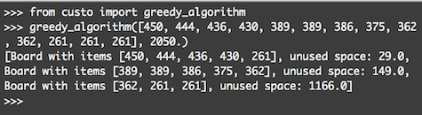

# custo
Cutting Stock Problem (1D) algorithms implemented with Python 3

## Purpose
The intent of this project is to code algorithm solutions the [Cutting Stock Problem](https://en.wikipedia.org/wiki/Cutting_stock_problem), an area of operations research.  

In short, the Cutting Stock Problem is a problem where we have material (like a metal pipe, or wood boards) which needs to be cut into pieces. These pieces should be laid out, across several boards, such that we can minimize wasted material (bits to short to use).

Code should be correct, readable, easy to use, and well-commented.  
  
---
## Getting Started
### Prerequisites
Python 3.6
### Installation
```
Clone repo into your project directory.
```
or  
```bash
git install git+https://github.com/filipwodnicki/custo.git
```
### Tests
```
cd custo    
  
python -m unittest discover tests
```

## Algorithms

### 1. First-fit Algorithm
This is the first algorithm implemented, a "hello world" of sorts. The First-fit Algorithm is a type of greedy approximation algorithm. It's called ["greedy"](https://en.wikipedia.org/wiki/Greedy_algorithm) because it optimizes at each step of calculation without considering the solution as a whole. Furthermore, even as a greedy algorithm it's only an approximation of the optimal result. Namely, at each step it doesn't check which piece fits best, it's just first-come-first-served!

Here's how it works:  

1. Sort input pieces by size  
2. Initialize the first Board, which will be output  
3. Try to arrange the largest item on the Board  
4. If there is space, place the item   
5. If there is no space, take a new Board off the shelf and place the item on that new Board  
6. Repeat #3-5 for each item, then return solution.   

Interestingly, Fit-first has been shown to always give results within 20-25% of the truly optimal solution.
  
#### Example usage
  
  


## Contributing
Please email author if interested.

## Changelog

#### v0.1.1
31.08.2018, Fix known bugs with import

#### v0.1.0
31.08.2018, Implemented Greedy Algorithm with tests  

## Acknowledgements

## License
MIT © Filip Wodnicki 2018